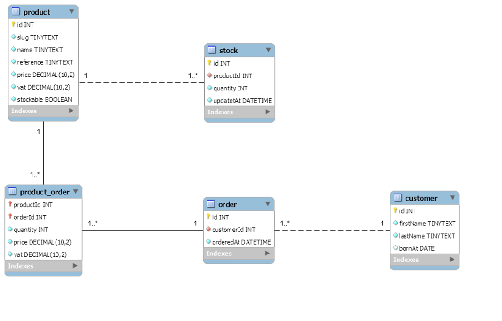
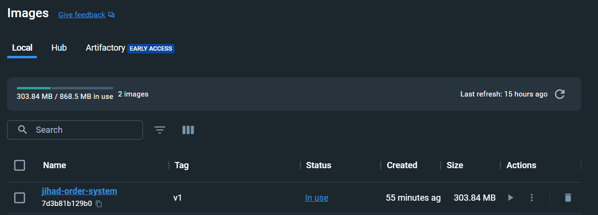

# Order-Managment-System
**Order Managment Spring Boot Project For WebServices Course**
## How to build the application:
> This is the ERD provided for the order system project

### For building the Application we need:
- Java installed on the machine - Java 17 is prefered because of the Spring boot application which is built on Java 17
- Local MySQL database on the machine
- Docker downloaded on the machine
- POSTMAN for API testing
## To build the application, Follow these steps:
### 1. Clone the repository: 
- git clone repository-url
### 2. Navigate to the project directory: 
- cd project-directory
### 3. Check in the pom.xml that all the dependencies are found
### 4. build application:
- mvn clean package
> This will compile the source code, run tests and package the application into an executable jar files.
### 5. The built jar file will be generated in the 'target/build' directory
The Application now should be built
# Building Docker Image
## To build application docker image follow these steps:
### 1. Make sure you have Docker installed on your machine. You can download and install Docker from the official website: [https://www.docker.com/get-started](https://www.docker.com/get-started).
### 2. Open a terminal or command prompt and navigate to the project directory.
### 3. Build the Docker image by running the following command:
- docker build -t your-image-name:tag .
> The image I'm using is jihad-order-system

### 4. Once the Docker image is built successfully, you can run a container using the image with the following command:
- docker run -p 8080:8080 your-image-name:tag
> The image I'm using is jihad-order-system
### 5. Access your application by opening a web browser and visiting [http://localhost:8080](http://localhost:8080).
